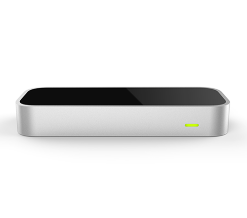

# Kivy 3D Motion Input

## Preface

The document proposes and offers a bounty for updating and enhancing the \
support for 3D input via [Ultraleap LeapMotion devices](https://developer.leapmotion.com/documentation/)
for the Kivy Input provider framework. Although Mathieu Virbel has already implemented a 
"proof-of-concept" as shown [in this video](https://www.youtube.com/watch?v=H_X0iEP9kHI), the device and
drivers have since been updated and extended.

This proposal would offer a bounty on:
* upgrading the [Kivy LeapFinger Input Provider](https://kivy.org/doc/stable-1.10.1/api-kivy.input.providers.leapfinger.html)
  to use the latest [Ultra Leap Motion devices](https://www.ultraleap.com/product/leap-motion-controller/).
* supporting 10 simultaneous [MotionEvents](https://kivy.org/doc/stable-1.10.1/api-kivy.input.motionevent.html)
  using this device.
* Updating the documentation to include setup and configuration instructions
  that would enable developers to easily setup these devices.

## Introduction

[Kivy](https://kivy.org) provides an extensible input architecture that
supports arbitrary input devices. Implementations include:
* touch screens,
* phones (iOS and Android)
* mouse and keyboard
* wacom tablets
* Windows Pens
* Mac Touchpads
* Microsoft Kinect
* older LeapMotion devices

This proposal seeks to update the support for LeapMotion devices, and aims to
provide out-of-the-box "gesture" or "motion" input for kivy widgets. Ideally,
existing and future Kivy applications should be able to easily incorporate
3D input devices without requiring any code changes.

Although gesture and motion input has long been hailed as the future of 
human-device interaction, adoption has been slow for various reasons:
* the devices have been expensive
* the technology has been imature
* the need has been low

The advent of the Corona virus epidemic, however, brings a new
value and importance to touchless interfaces. Having already integrated motion
input in three dimensions for multiple tracking points into it's core 
architecture, Kivy is pertfectly placed to provide touchless, gesture-based
input for cross platform, rapidly proto-typed applications.

## Proposal Overview

Before diving into the technical details of what this proposal would require,
we should first clearly define and establish the technical assumptions and \
language which we will use to describe the requirements.

The context to the solution be built upon:
* [Kivy Input Management](https://kivy.org/doc/stable-1.10.1/api-kivy.input.html),
* which provides a mechanism to register [Motion Event Providers](https://kivy.org/doc/stable-1.10.1/api-kivy.input.provider.html)
* for instantiation via a [Motion Event Factory](https://kivy.org/doc/stable-1.10.1/api-kivy.input.factory.html)
* which then creates [Motion Events](https://kivy.org/doc/stable-1.10.1/api-kivy.input.motionevent.html)

The concrete input providers are typically written in C/C++ and then made
available to the Python application via Cython wrappers. Although the scope of
this proposal shall only require a functional Linux implementation, the long
term goal would be to support Windows and Mac as well, all of which are already
supported by both Kivy and Leap Motion drivers.

## Technical Requirements

To lay claim to the bounty, we would require all the conditions of the 
*definition of done* be satified. Specifically, our definition of done shall
be:
* all the required code to implenment device support and the accompanying kivy
 artifacts shall be commited to a branch on the [Kivy github repo](https://github.com/kivy/kivy)
* the Leap Motion event provider shall support 10 simultaneous inputs, one for
  each finger.
* the MotionEvent shall be properly populated with the corresponding `pos3d` values. 
  Please see the [MotionEvent documentation](https://kivy.org/doc/stable-1.10.1/api-kivy.input.motionevent.html)
* the [Kivy LeapFinger documentation](https://kivy.org/doc/stable-1.10.1/api-kivy.input.providers.leapfinger.html)
  should be updated with complete installation and setup instructions.

## Bounty and Compenstaion

The bounry shall comprise a free Ultra LeapMotion device, as well as some cash
reward on completion of the task. This is tentatively initialised at US$ 200,
but is open to revision.

## Summary

In short, this proposal aims to bring 3D gesture input support too all Kivy applications via the Ultra LeapMotion device. The groundwork has already
been liad via the *LeapFinger* Input Provider, but this shall be refined and
brough up to date to run with the latest device and drivers.
